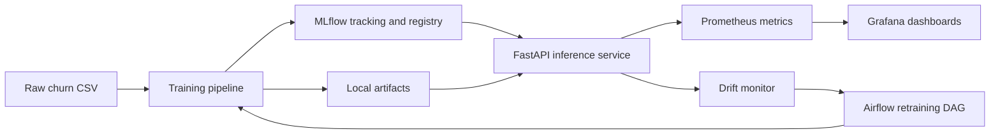
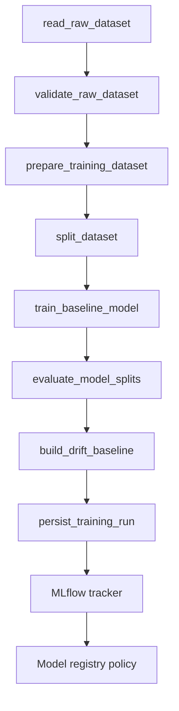

# Architecture

ChurnOps is structured as a small but end-to-end MLOps system. The codebase keeps business logic separate from orchestration, tracking, serving, and deployment concerns so each layer can evolve without rewriting the rest of the stack.

For local setup, running, and testing commands, use [README.md](../README.md).

## System Overview



## Training And Tracking Flow



Key design points:

- the local runner in `churnops.pipeline.runner` reuses the same stage functions that Airflow calls through `churnops.orchestration.training_tasks`
- persistence stays local-first so a full run bundle exists even when remote services are unavailable
- MLflow integration is isolated behind tracker abstractions
- drift baselines are produced from the training split and stored alongside the run metadata

## Inference And Monitoring Flow

```mermaid
flowchart TD
    A[HTTP request] --> B[FastAPI routes]
    B --> C[InferenceService]
    C --> D[Model loader]
    C --> E[Prediction pipeline]
    E --> F[Prediction response]
    C --> G[DriftMonitor]
    B --> H[Prometheus metrics middleware]
    H --> I[/metrics endpoint]
```

Key design points:

- route handlers remain thin and delegate business logic to the inference service
- request metrics and access logging are handled in middleware, not inside handlers
- readiness depends on model availability when preload is enabled
- drift evaluation runs after successful prediction and never blocks the response path

## Deployment Surfaces

ChurnOps currently supports three operational surfaces:

- local CLI execution for fast development and direct debugging
- Docker Compose for the integrated local platform with MLflow, Prometheus, Grafana, and Airflow
- Kubernetes manifests for cluster-style deployment of the inference service

Those surfaces all share the same runtime contract:

- `configs/base.yaml` defines the default application settings
- `CHURNOPS_*` environment variables override runtime behavior without code changes
- the inference image is the common deployment artifact across Docker and Kubernetes
- the API exposes `/health`, `/health/live`, `/health/ready`, and `/metrics` consistently

The main local commands are:

- `make train-fixture`
- `make serve`
- `make test`
- `make verify`
- `make platform-up`
- `make airflow-up`
- `make k8s-render-staging`
- `make k8s-render-production`

## Repository Boundaries

- `churnops.pipeline`: local training orchestration
- `churnops.orchestration`: Airflow-facing task wrappers and stage persistence
- `churnops.tracking`: experiment tracking and registry integration
- `churnops.inference`: model loading and prediction business logic
- `churnops.monitoring`: Prometheus metrics and HTTP instrumentation
- `churnops.drift`: baseline generation, PSI drift detection, persisted state, and retraining triggers
- `deploy/kubernetes`: cluster deployment assets

## Operational Tradeoffs

The current repository intentionally prefers clarity over platform breadth:

- the inference Deployment stays single-replica because artifact and drift state still live on a PVC
- retraining is triggered through Airflow instead of embedding scheduler logic into the API
- local persistence remains a first-class output even when MLflow is enabled
- the first drift detector uses PSI rather than a heavier statistical framework so the signals remain easy to audit
